`twitter-bot` is a framework to get you started with implementing a twitter webhook based bot in a quick and easy way.

## Apply for twitter developer account

##### - Navigate to https://developer.twitter.com/, and ensure you are logged in. 
##### - Once you are logged in, click on 'Apply' at the right-top corner of the screen

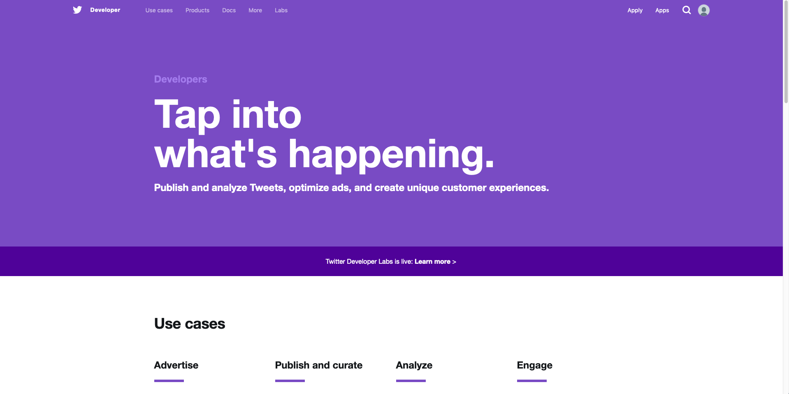

##### - Make sure you read and agree to conditions here: [Restricted usecases](https://developer.twitter.com/en/developer-terms/more-on-restricted-use-cases.html)

##### - Click on 'Apply for a developer acocunt' 
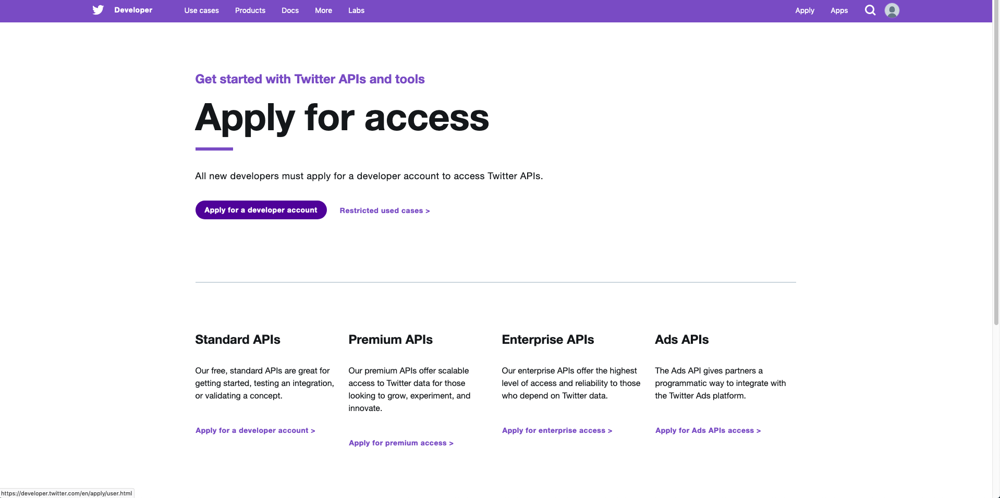

##### - Select your use case. we will select bot
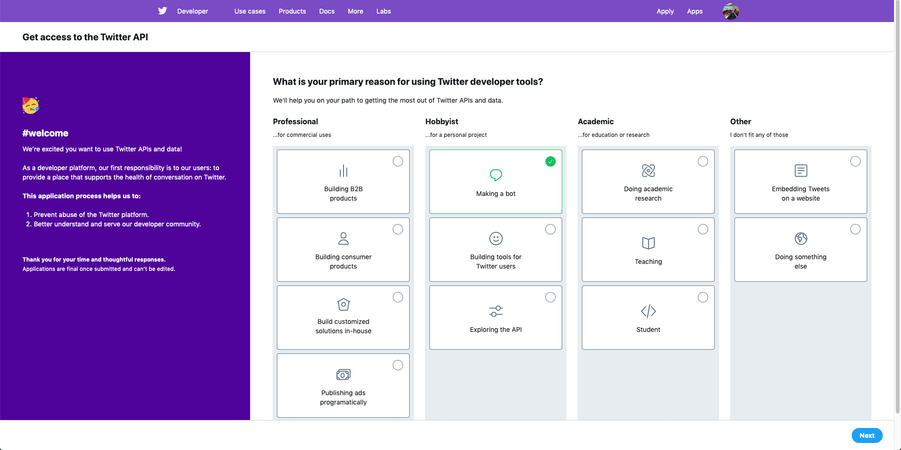

##### - Review and complete your details
> Note that email-address and phone-number are mandatory for registring the developer account.

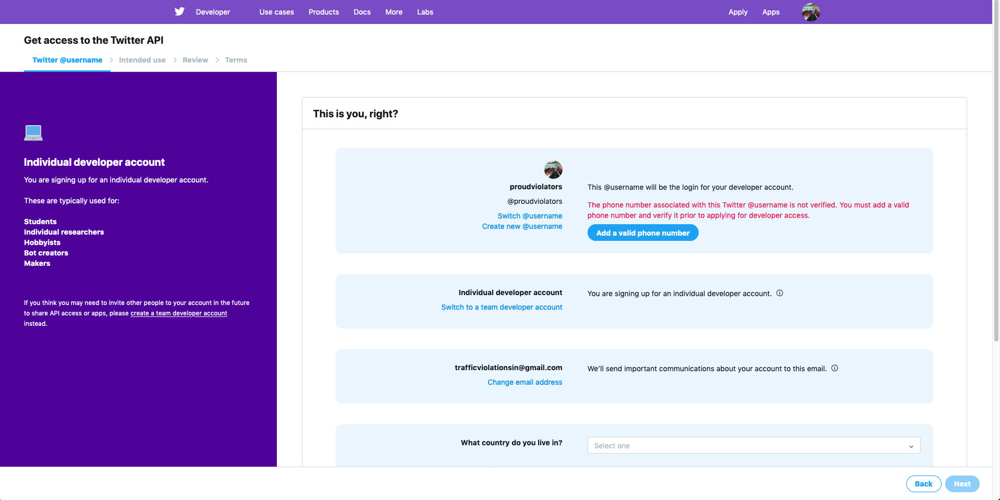

##### - Tell us about bot
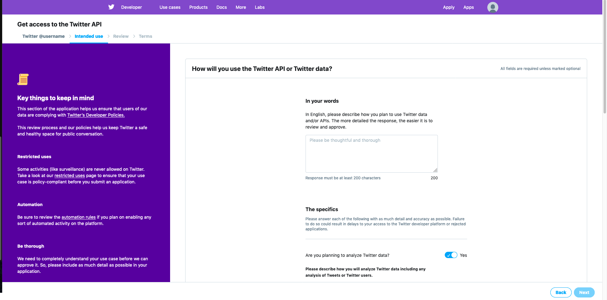

##### - Review the information you provided
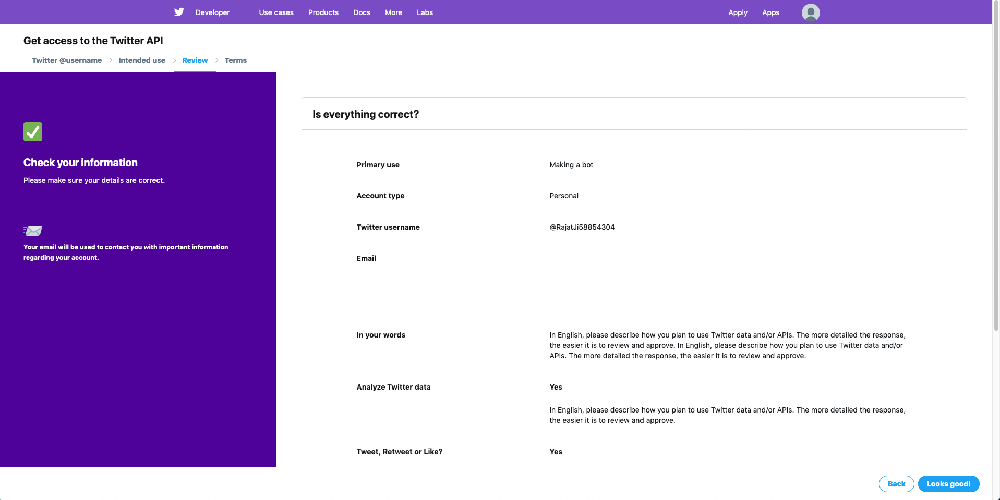

##### - review the agreement and click submit.
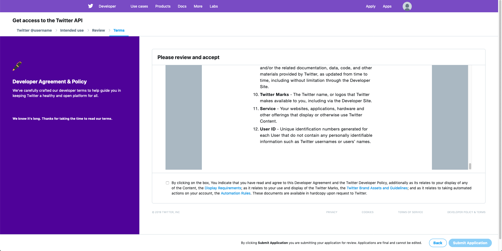

##### - If approved, you will get email for the same
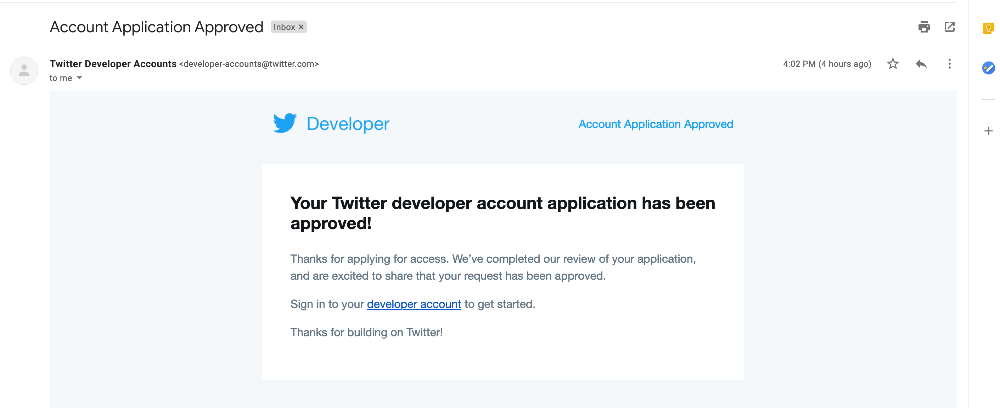


## create a new app

##### - Create a new app: https://developer.twitter.com/en/apps/create
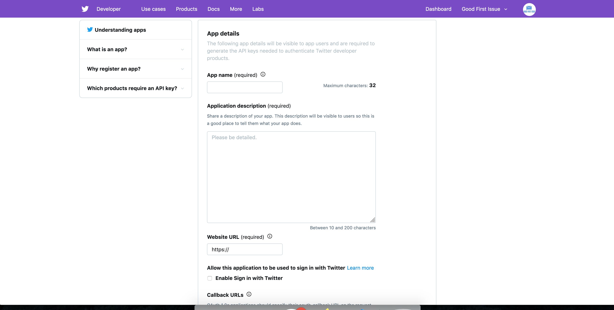

##### - Review terms and conditions
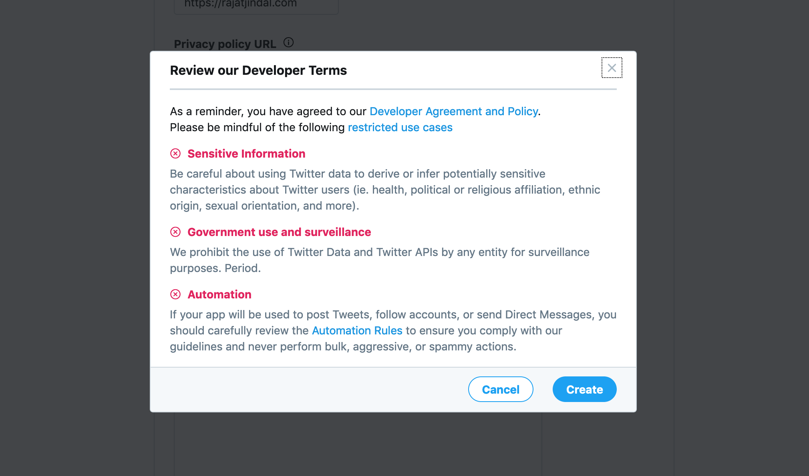

##### - Once created, navigate to Permissions tab and make sure you select the right permissions needed for your bot.
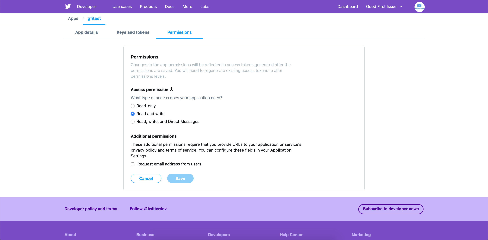

##### - Now navigate back to Keys/Tokens and create access token and access token secret. Save them in a safe place, we will need them again.
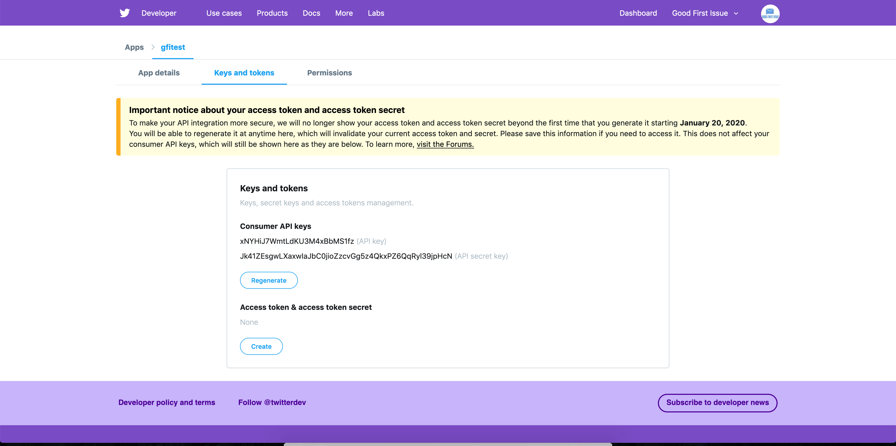


## setup new environment

##### - Now we need to create environment. Navigate to https://developer.twitter.com/en/account/environments. 
> For the webhook bot, you should select 'Account Activity API/Sandbox'
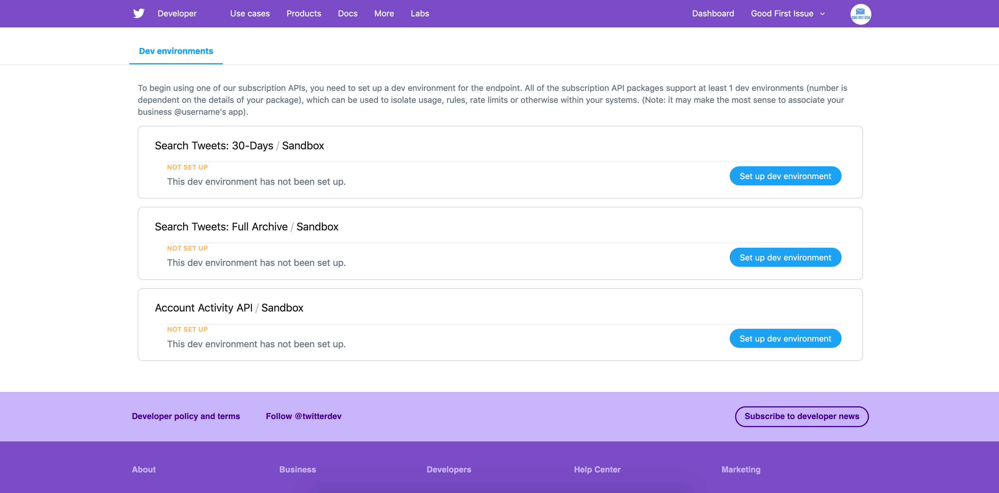

##### - Now enter 'Dev environment label'. e.g. 'dev' or 'prod' and select the app we just created from the dropdown
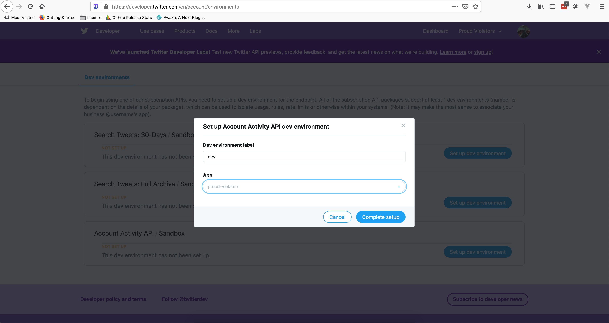

##### - Click complete setup and you are all set to start writing code
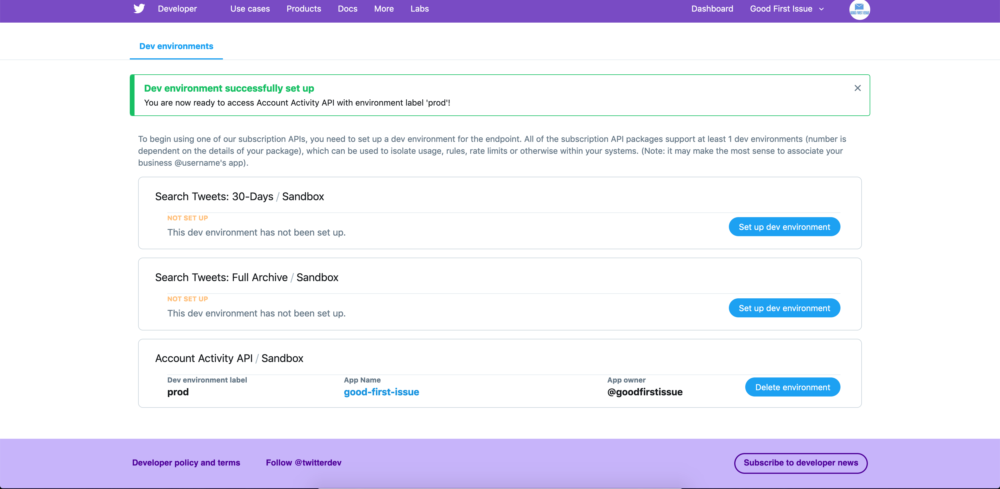


## OK, finally writing the code now

#### create new bot object

```golang
const (
	webhookHost     = "https://your-webhook-domain"
	webhookPath     = "/webhook/twitter"
	//has to be same as provided when getting tokens from twitter developers console
	environmentName = "prod" 
)

// use the tokens saved when following above steps
bot, err := twitter.NewBot(
		&twitter.BotConfig{
			Tokens: twitter.Tokens{
				ConsumerKey:   "<consumer-key>",
				ConsumerToken: "<consumer-token>",
				Token:         "<token>",
				TokenSecret:   "<token-secret>",
			},
			Environment:          environmentName,
			WebhookHost:          webhookHost,
			WebhookPath:          webhookPath,
			OverrideRegistration: true,
		},
	)
	if err != nil {
		logrus.Fatal(err)
	}

```

#### create a handler for the events you will receive from twitter
```golang

type webhookHandler struct{}

// This handler will handle the events from twitter. You can print it to console, forward it to yourself, 
// reply using twitter api. possibilities are endless.
func (wh webhookHandler) handler(w http.ResponseWriter, r *http.Request) {
	webhookBody, _ := httputil.DumpRequest(r, true)
	logrus.Info(string(x))
}

```

#### start a webserver to handle the webhook event from twitter.
> notice that for `GET` method, you need to add `bot.HandleCRCResponse` as handler. This is required for webhook to remain active

```golang
	wh := webhookHandler{}
	http.HandleFunc(webhookPath, func(w http.ResponseWriter, r *http.Request) {
		switch r.Method {
		case http.MethodGet:
			bot.HandleCRCResponse(w, r)
		case http.MethodPost:
			wh.handler(w, r)
		}
	})

	go func() {
		fmt.Println(http.ListenAndServe(":8080", nil))
	}()

```

#### finally trigger the registration and subscription of the webhook. Only after this is when you will start receiving actual webhook events

```golang
	// give time for http server to start and be ready
	// server needs to be up before we do registration and subscription
	// so that we can respond to CRC request
	time.Sleep(3)

	err = bot.DoRegistrationAndSubscribeBusiness()
	if err != nil {
		logrus.Fatal(err)
	}
```

Look at [main.go](main.go) for complete example

## Contributing

Found an issue in documentation or code, please report [issue](https://github.com/rajatjindal/twitter-bot/issues/new)